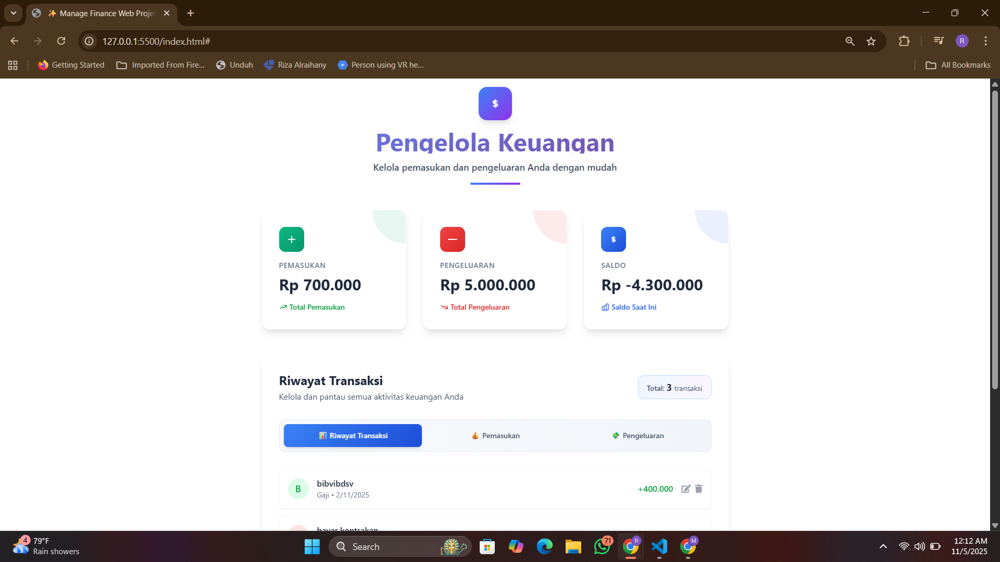
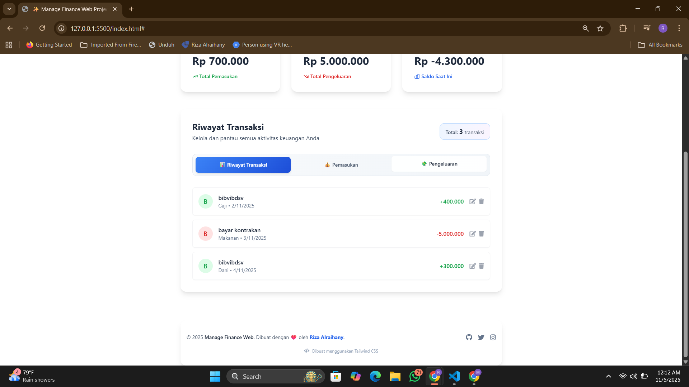

# ✨ Manage Finance Web Project ✨

Aplikasi web sederhana untuk **mengelola keuangan pribadi**, meliputi pemasukan, pengeluaran, dan saldo akhir.
Didesain dengan tampilan modern menggunakan **Tailwind CSS** dan gaya _glassmorphism_.

---

## 🚀 Fitur Utama

✅ **Dashboard Ringkas**

- Menampilkan total pemasukan, pengeluaran, dan saldo saat ini secara real-time.

✅ **Riwayat Transaksi**

- Lihat semua aktivitas keuangan dalam tampilan yang bersih dan mudah dibaca.

✅ **Manajemen Pemasukan & Pengeluaran**

- Tambah, edit, atau hapus transaksi.
- Input kategori, tanggal, dan keterangan untuk setiap transaksi.

✅ **Mode Gelap (Dark Mode)**

- Ganti tema dengan satu klik untuk pengalaman visual yang nyaman di malam hari.

✅ **Desain Modern**

- Menggunakan Tailwind CSS, FontAwesome, dan efek _glass-effect_ dengan _gradient color_.

---

## 🛠️ Teknologi yang Digunakan

| Teknologi                | Deskripsi                                        |
| ------------------------ | ------------------------------------------------ |
| **HTML5**                | Struktur halaman utama aplikasi                  |
| **Tailwind CSS**         | Styling modern berbasis utility classes          |
| **JavaScript (Vanilla)** | Logika aplikasi & pengelolaan data               |
| **FontAwesome**          | Ikon profesional untuk UI                        |
| **LocalStorage**         | Menyimpan data transaksi secara lokal di browser |

---

## 📦 Struktur Folder

```
📂 project-root
│
├── 📁 src
│   ├── 📁 js
│   │   └── index.js        # Logika aplikasi utama
│   ├── 📁 style
│   │   └── global.css      # Styling tambahan
│
├── index.html               # Halaman utama
├── README.md                # Dokumentasi proyek
└── /assets (opsional)       # Folder tambahan untuk gambar/icon
```

---

## ⚙️ Cara Menjalankan

1. **Clone repository:**

   ```bash
   git clone https://github.com/username/manage-finance-web.git
   ```

2. **Masuk ke folder proyek:**

   ```bash
   cd manage-finance-web
   ```

3. **Buka di browser:**

   - Klik dua kali `index.html`, atau
   - Jalankan server lokal:

     ```bash
     npx vite
     ```

     lalu buka di `http://localhost:5173/`

---

## 📸 Tampilan Aplikasi

Berikut tampilan antarmuka dari aplikasi **Manage Finance Web**:



---

## 👨‍💻 Developer

**Dibuat oleh:**
💙 [Riza Alraihany](https://github.com/RizaAlraihany)

📧 _Untuk kolaborasi atau pengembangan lanjutan, silakan hubungi saya!_

---

## 📄 Lisensi

Proyek ini dilisensikan di bawah lisensi **MIT License** — bebas digunakan dan dimodifikasi untuk keperluan pribadi maupun komersial.

---

> “Kelola keuangan dengan cerdas, mulai dari hal kecil.” 💰
